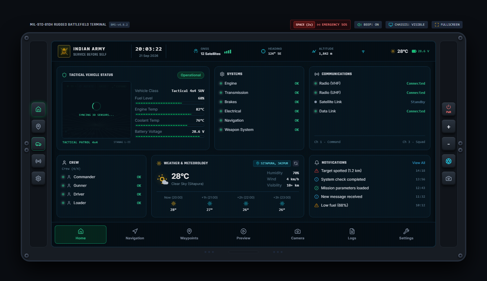
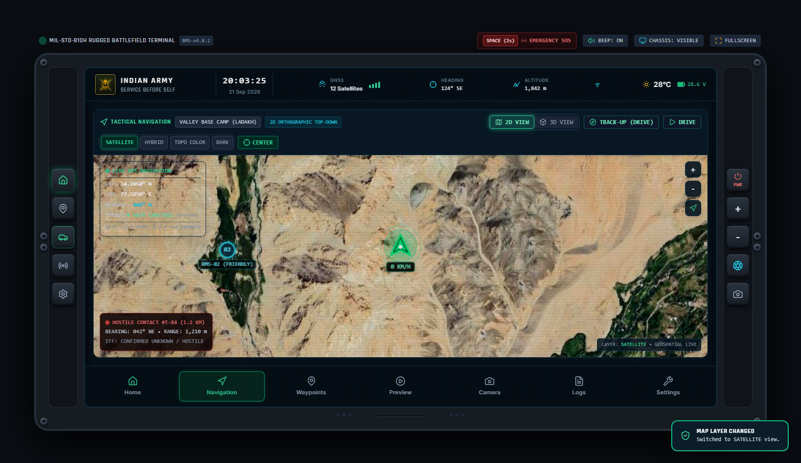
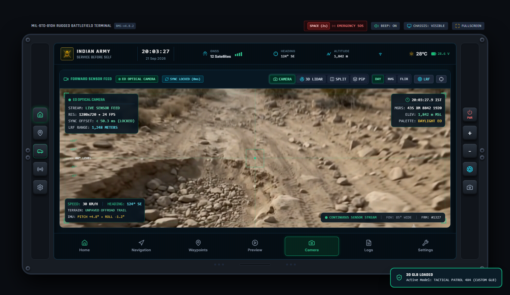
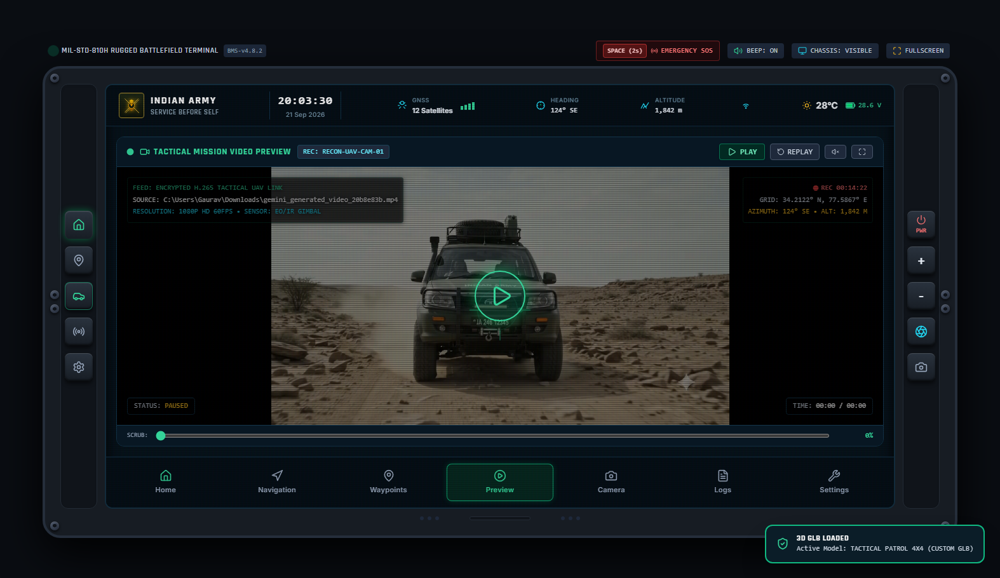
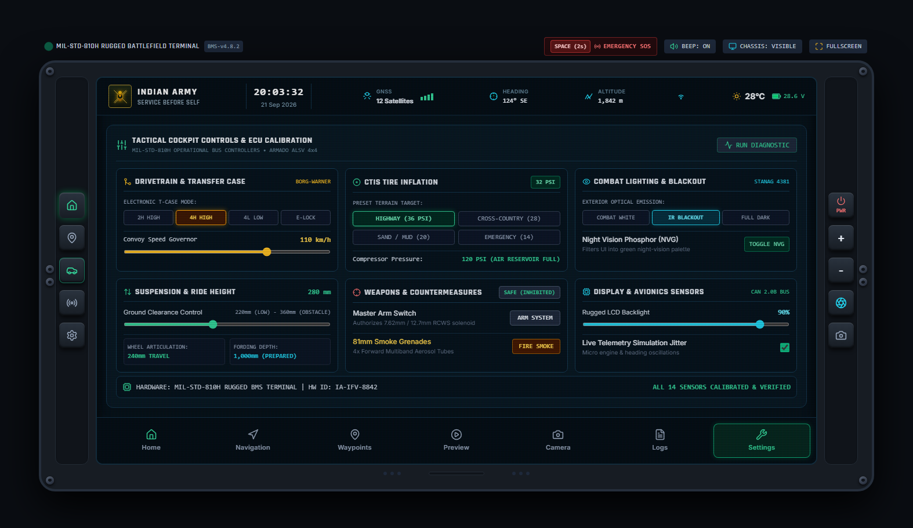
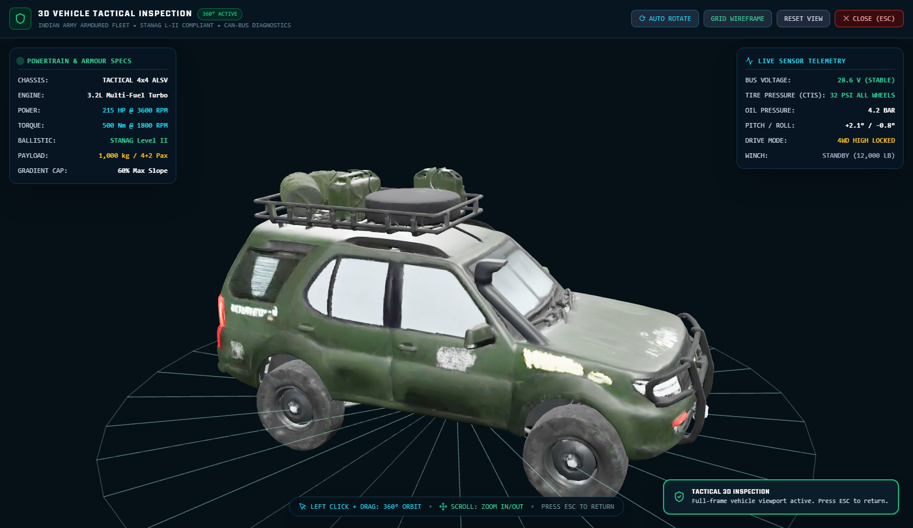
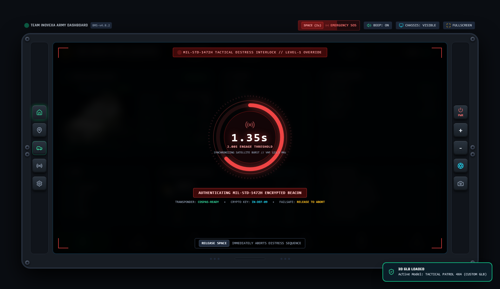
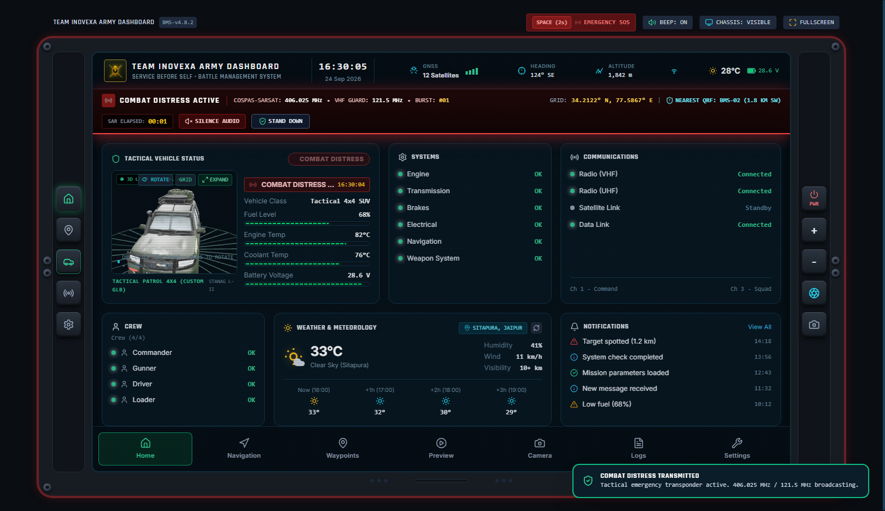

# Team Inovexa Army Dashboard 🇮🇳
### MIL-STD-810H & STANAG Level II Battle Management System (BMS) Dashboard

[](https://gauravrajpurohit110-star.github.io/team-inovexa-army-dashboard/)
[](https://en.wikipedia.org/wiki/MIL-STD-810)
[](https://en.wikipedia.org/wiki/STANAG_4569)
[](LICENSE)

An offline-first, browser-based, high-definition Tactical Battle Management System (BMS) and Autonomous Sensor Fusion Cockpit for Indian Army Armoured Patrol Vehicles and Light Specialist Vehicles (ALSV).

🌐 **Live Deployment**: [https://gauravrajpurohit110-star.github.io/team-inovexa-army-dashboard/](https://gauravrajpurohit110-star.github.io/team-inovexa-army-dashboard/)

---

## 📸 Visual Showcase

### 1. Tactical Vehicle Operations Center (Home Tab)
Real-time 3D GLB vehicle model with rotation controls, live Sitapura (Jaipur) meteorological feed, MIL-STD-810H telemetry dials, and squad communications.



---

### 2. Geospatial Battlespace Map (2D & 3D Navigation)
Interactive satellite imagery, OpenTopoMap hypsometric elevation contours, dynamic Track-Up / North-Up driving orientation, and live Ladakh sector vehicle patrol physics.



---

### 3. Electro-Optical (EO) Camera & 3D Adaptive LiDAR Feed
Sub-frame time-synchronized dual video feeds, multi-spectrum palettes (Daylight, NVG Phosphor, FLIR Thermal), mil-dot targeting reticle, and laser rangefinder HUD.



---

### 4. Tactical UAV Mission Video Preview
Military reconnaissance video playback engine with timeline scrubber, UAV coordinate watermarks, and tactical audio feedback.



---

### 5. Cockpit ECU & Drivetrain Calibration (Settings Tab)
Electronic transfer case mode selector (2H, 4H, 4L, E-Locker), Central Tire Inflation System (CTIS) terrain presets, combat blackout lighting, and master arm controls.



---

### 6. Full-Frame 360° 3D Vehicle Inspection Modal
Double-click on the rotating vehicle model to enter an expanded 360° inspection stage with wireframe diagnostic mode and complete powertrain armor specifications.



---

### 7. MIL-STD-1472H Tactical Defense Interlock & Combat Distress Mode
Holding the physical **Spacebar for 2.0 seconds** activates an authentic military-grade ballistic glass Tactical HUD Interlock with a 360° Circular Chrono-Ring, microsecond countdown (`0.00s` -> `2.00s`), transponder frequency synchronization (`406.025 MHz`), and cryptographic authorization keys. Releasing before 2.0s gracefully disengages the interlock (`SAFETY INTERLOCK RESTORED // DISTRESS ABORTED`).

Upon the 2.0-second commit, the terminal enters whole-system **Combat Distress Mode**:
- **Integrated Emergency Command Strip**: Docks seamlessly beneath the top bar with COSPAS-SARSAT transponder frequencies, burst counters, live SAR elapsed clock, and nearest Quick Reaction Force vector (`BMS-02`).
- **Tactical Vehicle Status (Card 1)**: Operational badge transitions into high-visibility `COMBAT DISTRESS` telemetry.
- **Leaflet Map (Card 3)**: Projects a pulsating SAR beacon radar ring and tactical rescue vector polyline to nearest friendly unit.
- **Avionics Master Caution**: Dual-tone military cockpit chime (`880 Hz -> 440 Hz`) with one-click `[SILENCE AUDIO]` and `[STAND DOWN]` controls.




---

## ⚡ Key Highlights & Capabilities

* **Zero-Latency Offline-First**: Operates natively in any browser with zero local server requirements and pure client-side asset rendering.
* **Sitapura, Jaipur Real Weather**: Direct Open-Meteo integration delivering live temperature, relative humidity, wind velocity, and visibility with smart 5-minute caching.
* **Google Maps Track-Up Navigation**: Automatic map rotation following vehicle heading or classic True North grid alignment.
* **Pure Audio Synthesis**: Tactical beeps, alarm sirens, and relay clicks generated in real-time using the browser Web Audio API (zero bulky sound files).
* **Hardware-Accelerated 3D Engine**: Low-power Three.js WebGL rendering that automatically suspends when tabs are switched to preserve battery.

---

## 🚀 Quickstart & Offline Deployment

### Run Locally:
```bash
# 1. Clone repository
git clone https://github.com/gauravrajpurohit110-star/team-inovexa-army-dashboard.git

# 2. Enter folder
cd team-inovexa-army-dashboard

# 3. Open in browser (Chrome / Edge / Firefox)
start chrome indian_army_tactical_vehicle_terminal.html
```

---

## 🎮 Keyboard & Touch Controls

| Shortcut / Gesture | Action |
|---|---|
| **Spacebar (Hold 2.0s)** | Engage MIL-STD-1472H Tactical Distress Interlock & Combat Distress Mode |
| **Double Click (on 3D Model)** | Expand to 360° Full-Frame Vehicle Inspection View |
| **Left Click + Drag (3D)** | Rotate vehicle model 360° in orbit |
| **Scroll Wheel (3D / Map)** | Zoom camera in and out |
| **`ESC` Key** | Close 3D full-frame inspection modal or dismiss SOS |

---

## 🛠️ Technology Stack

* **Front-End**: HTML5, Tailwind CSS, Lucide Icons
* **3D Graphics**: Three.js, GLTFLoader, OrbitControls
* **Mapping**: Leaflet.js, Google Satellite, OpenTopoMap, CartoDB Dark Matter
* **Audio**: Web Audio API (OscillatorNode, GainNode)
* **Meteorology**: Open-Meteo Client REST API

---

*Engineered for Defense & Tactical Ground Mobility Demonstrations.*
